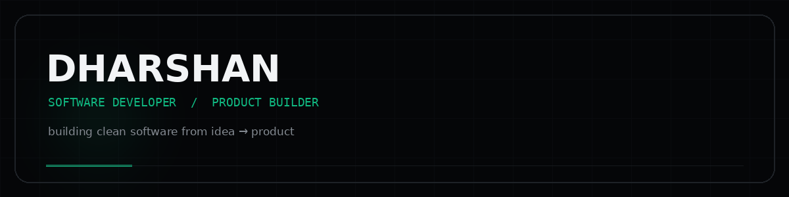
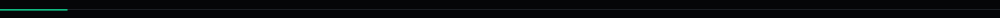

<div align="center">



<br>

<a href="https://github.com/dharshan555-code">

</a>

<br><br>

<a href="https://github.com/dharshan555-code">

</a>
<a href="https://www.linkedin.com/in/dharshan-p-ba4734370/">

</a>
<a href="https://instagram.com/dharshanprabath">

</a>

</div>



## `01 — ABOUT`

<table>
<tr>
<td width="60%" valign="top">

### Dharshan

CSE student and software developer focused on building **clean software, useful products and practical systems**.

I like taking ideas from:

`concept` → `prototype` → `product`

**Focus**

- Full-stack development
- Developer tools
- Automation
- Mobile applications
- Software systems

</td>
<td width="40%" valign="top">

```text
CURRENT MODE

learn       ██████████
build       █████████
ship        ████████
improve     ██████████
```

</td>
</tr>
</table>

---

## `02 — TECHNOLOGY`

<div align="center">

<a href="https://www.python.org/"></a>
<a href="https://isocpp.org/"></a>
<a href="https://developer.mozilla.org/en-US/docs/Web/JavaScript"></a>
<a href="https://www.typescriptlang.org/"></a>
<a href="https://react.dev/"></a>
<a href="https://nextjs.org/"></a>
<a href="https://nodejs.org/"></a>
<a href="https://fastapi.tiangolo.com/"></a>
<a href="https://supabase.com/"></a>
<a href="https://developer.android.com/"></a>
<a href="https://git-scm.com/"></a>
<a href="https://github.com/"></a>

</div>

<p align="center"><sub>click any icon to open its official site</sub></p>

---

## `03 — PROJECTS`

<table>
<tr>
<td width="50%" valign="top">

### JARVIS

Personal computer assistant project focused on tools, automation, computer interaction and intelligent workflows.

<a href="https://github.com/dharshan555-code?tab=repositories">VIEW REPOSITORIES →</a>

</td>
<td width="50%" valign="top">

### HabitIQ

Minimal productivity and habit-tracking application focused on routines, reminders and personal progress.

<a href="https://github.com/dharshan555-code?tab=repositories">VIEW REPOSITORIES →</a>

</td>
</tr>
</table>


## `04 — GITHUB`

<div align="center">


<br><br>


</div>

---

## `05 — CONNECT`

<div align="center">

<a href="https://github.com/dharshan555-code">

</a>
<a href="https://www.linkedin.com/in/dharshan-p-ba4734370/">

</a>
<a href="https://instagram.com/dharshanprabath">

</a>

<br><br>

```text
BUILD  →  SHIP  →  LEARN  →  REPEAT
```

<sub>DHARSHAN · SOFTWARE DEVELOPER</sub>

</div>
